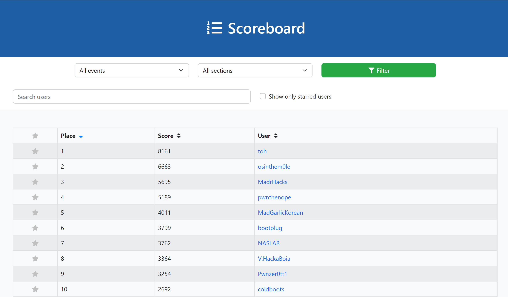

# Srdnlen CTF 2022

Srdnlen CTF 2022 is the first edition of the online Jeopardy-style Capture-The-Flag competition hosted by the members of [Srdnlen](https://srdnlen.unica.it/), an italian team based in Sardinia, supported by the italian [Cybersecurity National Laboratory](https://cybersecnatlab.it/).

   

- [CTFtime event](https://ctftime.org/event/1766/)

## Challenges

| Category | Challenge                                             | Author                                      | Protocol |                              Url |  Port |
| :------- | :---------------------------------------------------- | :------------------------------------------ | -------: | -------------------------------: | ----: |
| Osint    | [Welcome](/misc_welcome)                              | [slsanna](https://github.com/slsanna)       |          |                                  |       |
| Osint    | [Osint1](/misc_osint1)                                | [slsanna](https://github.com/slsanna)       |          |                                  |       |
| Osint    | [Osint2](/misc_osint2)                                | [slsanna](https://github.com/slsanna)       |          |                                  |       |
| Osint    | [Osint3](/misc_osint3)                                | [slsanna](https://github.com/slsanna)       |          |                                  |       |
| Foren    | [Song](/foren_song)                                   | [slsanna](https://github.com/slsanna)       |          |                                  |       |
| Foren    | [Unesco](/foren_unesco)                               | [slsanna](https://github.com/slsanna)       |          |                                  |       |
| Foren    | [LenSrdnBand-corrupted](/foren_LenSrdnBand-corrupted) | [minn3](https://github.com/minn3)           |          |                                  |       |
| Foren    | [Network-spy](/foren_network-spy)                     | [slsanna](https://github.com/slsanna)       |          |                                  |       |
| Foren    | [Network-keylogger](/foren_network-keylogger)         | [slsanna](https://github.com/slsanna)       |          |                                  |       |
| Foren    | [Network-exfiltration](/foren_network-exfiltration)   | [slsanna](https://github.com/slsanna)       |          |                                  |       |
| Web      | [I love pickles](/web_ilovepickles)                   | [pysu](https://github.com/lpisu98)          |     http |   ilovepickles.challs.srdnlen.it |    80 |
| Web      | [Colorgram](/web_colorgram)                           | [takenX10](https://github.com/takenX10)     |     http |      colorgram.challs.srdnlen.it |    80 |
| Web      | [pugQL](/web_pugql)                                   | [dockOck](https://github.com/dockOck)       |     http |          pugql.challs.srdnlen.it |    80 |
| Rev      | [Breach Paradigm](/rev_breachparadigm)                | [zoop](https://github.com/zoopr)            |          |                                  |       |
| Rev      | [Fair and Balanced](/rev_fairandbalanced)             | [zoop](https://github.com/zoopr)            |      tcp |            fab.challs.srdnlen.it | 15000 |
| Rev      | [Macroblaster Hell](/rev_macroblaster_hell)           | [astraldavezero](.)                         |          |                                  |       |
| Pwn      | [Connect4](/pwn_connect4)                             | [xavimel](https://github.com/xavimel)       |      tcp |       connect4.challs.srdnlen.it | 15001 |
| Pwn      | [Rat Pack](/pwn_ratpack)                              | [zoop](https://github.com/zoopr)            |      tcp |           rats.challs.srdnlen.it | 15002 |
| Pwn      | [babyheap](/pwn_babyheap)                             | [ricchi24](https://github.com/ricchi24)     |      tcp |       babyheap.challs.srdnlen.it | 15003 |
| Pwn      | [COOKB00K](/pwn_cookb00k)                             | [doliv](https://github.com/doliv8)          |      tcp |       cookb00k.challs.srdnlen.it | 15004 |
| Crypto   | [Easy_RSA](/crypto_easyrsa)                           | [philippo01](https://github.com/philippo01) |      tcp |        easyrsa.challs.srdnlen.it | 15005 |
| Crypto   | [wtfRSA](/crypto_wtfrsa)                              | [philippo01](https://github.com/philippo01) |          |                                  |       |
| Crypto   | [One Flag Padding](/crypto_oneflagpadding)            | [zaua](https://github.com/giomanca97)       |      tcp | oneflagpadding.challs.srdnlen.it | 15006 |
| Crypto   | [Fancy_e](/crypto_fancye)                             | [zaua](https://github.com/giomanca97)       |      tcp |         fancye.challs.srdnlen.it | 15007 |
| Crypto   | [Give Me A Bag](/crypto_givemeabag)                   | [Geladen](.)                                |          |                                  |       |

## Final scoreboard

### Top 10

### Full scoreboard

- [Full scoreboard](images/scoreboard.png)
- [Solves](images/solves.png)
